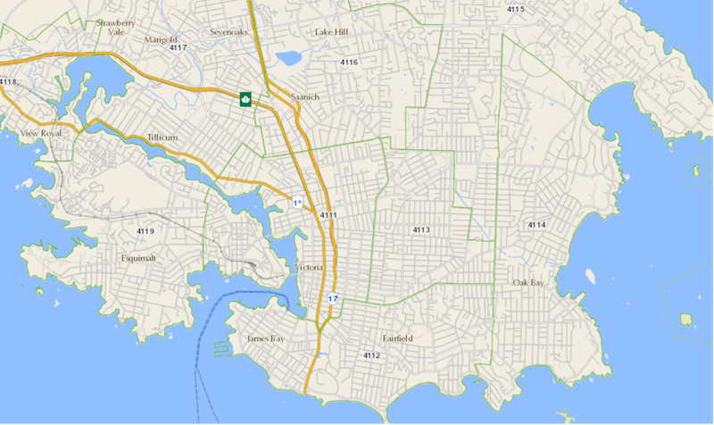

# areaservice
Community Health Service Area (chsa) locator service

The backend application uses Spring Boot with gradle, and handles GET requests/responses to/from an [external REST API](#the-open-maps-api) and is designed to feed a single page application (SPA) frontend that has yet to be built. The latitude/longitude parameters sent to the Open Maps API can be used as frontend input fields. The backend will only run if the PostGreSQL instance is also up and running. The application structure includes Rest controller, service, model, data entity and data repository. 
    
The PostGreSQL database is running in a PostGIS docker container, including three tables: `request`, `response` and `chsa` (store the area code and area name). All the requests to the sample API should be stored in the `request` table. The `response` table has a foreign key `response.request_id` which should be linked to its `request.id`. The value of `response.chsa_sys_id` is not unique in the `response` table though it should be derived from the value in `chsa.sys_id` (which is unique). The remaining development is to parse the response and store data in `response` and `chsa` tables. 

1. PostGreSQL database
   ## create mySQL podman/docker container
   `podman run --name chsa-postgis -p 5432:5432 -e POSTGRES_PASSWORD=pwd -d postgis/postgis`
    **OR**
   `docker run --name chsa-postgis -p 5432:5432 -e POSTGRES_PASSWORD=pwd -d postgis/postgis`


   ## connect as sql client
    `podman exec -it chsa-postgis psql -U postgres`
    (input Password)
    **OR**
    `docker exec -it chsa-postgis psql -U postgres`

   ## create database (inside running container)
    `CREATE DATABASE healthservice;`

   ## switch to healthservice database
    `\c healthservice` 

   ## create postGIS extension
    `CREATE EXTENSION postgis;`

   ## create tables inside DATABASE healthservice

   1) request table
      ```
      CREATE TABLE request (
         id serial PRIMARY KEY,
         feature_id varchar(100) NOT NULL,
         coordinate varchar(23),
         request_time timestamp
      );
      ```

   2) response table
      ```
      CREATE TABLE response (
         id serial PRIMARY KEY,
         request_id bigint NOT NULL,
         response_time timestamp,
         chsa_sys_id bigint,
         CONSTRAINT fk_request
            FOREIGN KEY(request_id)
               REFERENCES request(id)
               ON DELETE CASCADE
      );
      ```

   3) chsa table
      ```
      CREATE TABLE chsa (
         id serial PRIMARY KEY,
         sys_id bigint NOT NULL,
         areaname varchar(100) NOT NULL,
         areacode varchar(4) NOT NULL,
         object_id int,
         UNIQUE (sys_id)
      );
      ```

   Verify that tables have been created: 
   `\dt`

   Exit out of postgres:
   `\q` 

   Test that the container is running: 
   `podman ps`
   **OR**
   `docker ps`

2. Backend Application start

   ## Requirements
   - gradle v6.x (this app is not compatible with gradle v7.x)
   - java v11.x

   `cd areaservice`
   `./gradlew bootRun`

   you can test it by visiting `http://localhost:8090/area/-123.3646335+48.4251378` in your browser. The expected response is "Downtown Victoria/Vic West". By changing the lat/long you can see the name of a different CHSA, for instance `http://localhost:8090/area/-123.0555154+49.3235638` should return "North Vancouver City - East" 

## The Open Maps API

The rollout of COVID-19 vaccinations required that people either know or can find their Health Authority Area based on where they live and work. This web service needs to consider the connection between where someone lives (in B.C.) and the corresponding Community Health Service Area (CMNTY_HLTH_SERV_AREA_NAME). In the map below, Community Health Service Areas are indicated by their codes (4111, 4112, 4113, etc.). The green boundaries on this map, with corresponding CHSA number codes (CMNTY_HLTH_SERV_AREA_CODE) at their centers, depict some sample boundaries of CHSAs near Victoria, BC. 



The following Open Maps API request takes latitude (+48.4251378) and longitude (-123.3646335) values as a specific point in Victoria and returns the name of the Community Health Service Area and the Community Health Service Area Code:

CMNTY_HLTH_SERV_AREA_NAME: “Downtown Victoria/Vic West” 
CMNTY_HLTH_SERV_AREA_CODE: “4111”

Example Open Maps API request:
https://openmaps.gov.bc.ca/geo/pub/ows?service=WFS&version=2.0.0&request=GetFeature&typeName=pub%3AWHSE_ADMIN_BOUNDARIES.BCHA_CMNTY_HEALTH_SERV_AREA_SP&srsname=EPSG%3A4326&cql_filter=INTERSECTS(SHAPE%2CSRID%3D4326%3BPOINT(-123.3646335+48.4251378))&propertyName=CMNTY_HLTH_SERV_AREA_CODE%2CCMNTY_HLTH_SERV_AREA_NAME,SHAPE&outputFormat=application%2Fjson

API Documentation:
1.	Open Maps API: https://docs.geoserver.org/latest/en/user/services/wfs/reference.html 
